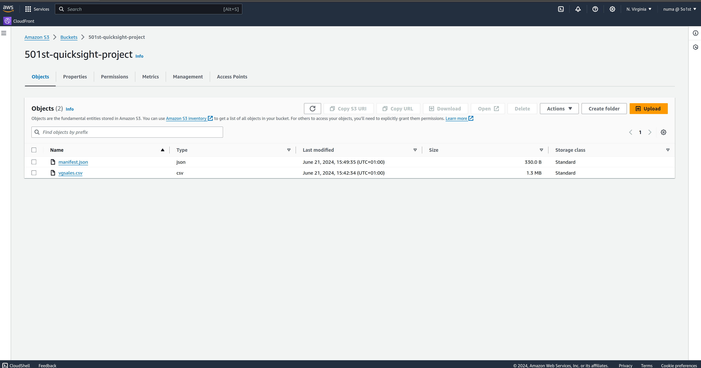
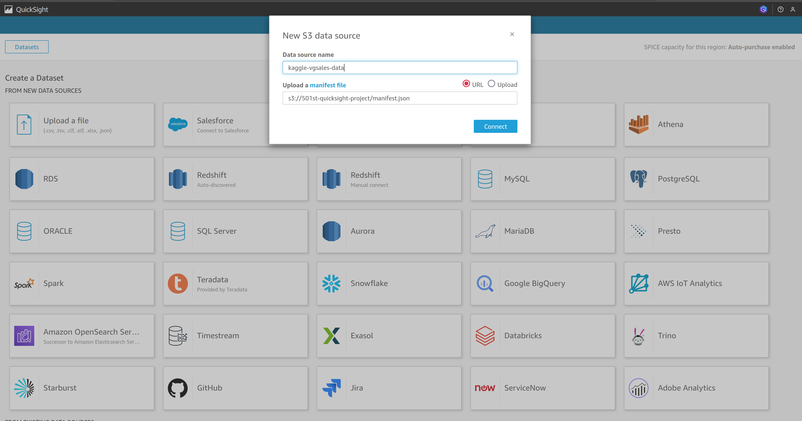
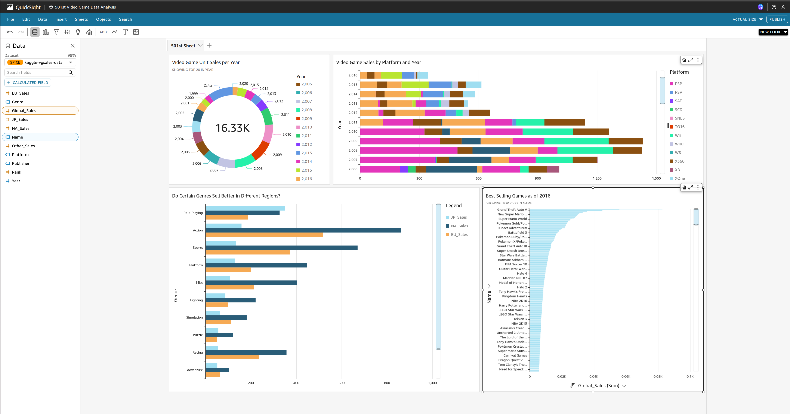

# VideoGame_DataAnalysis_With_AmazonQuicksight
Amazon QuickSight is an AWS business intelligence service that provides easy-to-understand insights by connecting and combining data from various cloud sources.

The dataset used for this dashboard was sourced from [Kaggle](https://www.kaggle.com/datasets/gregorut/videogamesales), an online community and platform for data science and machine learning enthusiasts.

  

_Below is the process and end result of using a dataset to establish a custom dashboard with QuickSight to visualize the data with deisred parameters for analysis:_

#### Dataset --------------> S3 <--------------> QuickSight

 

**S3 Bucket**

 
  

  

**Connecting S3 Data to QuickSight**

 
  

  

**Final Dashboard**

 
  

  

### Implementation Guide

   1) Create S3 Bucket. 
   2) Store desired Dataset and [manifest.json](https://docs.aws.amazon.com/quicksight/latest/user/supported-manifest-file-format.html) in the S3 Bucket (Note down manifest.json URI). 
   3) Create a QuickSight account (if you have not already) through the AWS Console. Ensure your account has necessary permissions to interact with S3 (or wherever your data is stored i.e. RDS, Athena, MySQl etc).
   4) In QuickSight, create a Dataset, choose S3 from the Data Source options, and paste in your manifest.json URI.
   5) Feel free to create your dashboard and experiment with the tools available in QuickSight on your data.
   6) Ensure that if this is temporary usage of QuickSight, you [delete your QuickSight Account](https://docs.aws.amazon.com/quicksight/latest/user/closing-account.html). 
   
